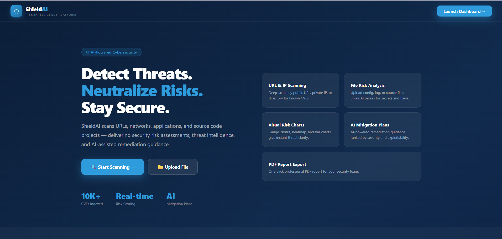
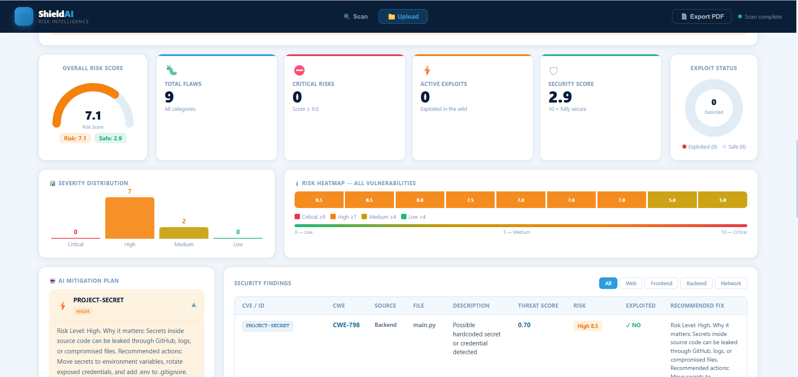
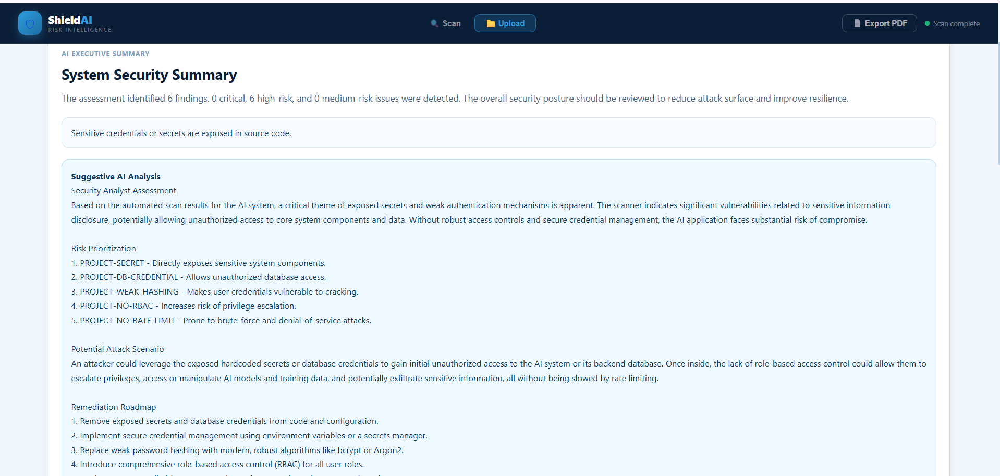

# 🛡 ShieldAI - AI-Powered Security Risk Rating Engine

<p align="center">
  
</p>

<p align="center">
  <strong>An AI-powered cybersecurity platform that analyzes applications, source code, URLs, and network configurations to identify security vulnerabilities and generate intelligent remediation recommendations.</strong>
</p>

<p align="center">


</p>

---

# 📖 Overview

ShieldAI is an AI-assisted cybersecurity platform designed to automatically detect security vulnerabilities across applications, source code, backend services, frontend projects, URLs, and network configurations.

The system combines automated vulnerability scanning with AI-powered security analysis to provide risk scoring, mitigation recommendations, executive summaries, and downloadable security reports.

---

# 🚀 Key Features

- 🔍 AI-powered vulnerability scanning
- 📂 Source code analysis
- 🌐 URL & IP scanning
- 🖥 Backend security assessment
- 🎨 Frontend security assessment
- 🌐 Network security evaluation
- 📊 Real-time security dashboard
- 📈 Risk score calculation
- 🔥 Vulnerability heatmaps
- 📑 AI-generated executive summary
- 🤖 Intelligent remediation plans
- 📄 Professional PDF report generation
- ⚠ Severity classification
- 🔐 CWE-based vulnerability mapping

---

# 🛠 Tech Stack

## Frontend

- React
- JavaScript
- HTML5
- CSS3
- Tailwind CSS
- Chart.js

## Backend

- FastAPI
- Python
- SQLAlchemy
- Pydantic

## Database

- PostgreSQL

## Security

- JWT Authentication
- Password Hashing
- Environment Variables
- Role-based Access Control (RBAC)

---

# 🏗 System Architecture

```
                    User
                     │
                     ▼

             React Frontend Dashboard
                     │
              REST API Requests
                     ▼

             FastAPI Backend Engine
                     │
     ┌───────────────┼────────────────┐
     │               │                │
     ▼               ▼                ▼

AI Analysis     Risk Engine     Vulnerability Scanner

                     │

                     ▼

              PostgreSQL Database
```

---

# 📸 Application Preview

## Landing Page



---

## Security Dashboard


---

## Vulnerability Heatmap



---

## AI Mitigation Plans



---

## Security Findings


---

# 🔍 Vulnerabilities Detected

The platform identifies security issues such as:

- Hardcoded Secrets
- Weak Password Hashing
- Missing RBAC
- Missing Rate Limiting
- Weak CORS Configuration
- Database Credential Exposure
- Authentication Weaknesses
- Configuration Issues

---

# 🤖 AI Security Analysis

ShieldAI generates:

- Executive Summary
- Risk Prioritization
- Potential Attack Scenarios
- Business Impact Assessment
- AI-powered Remediation Roadmap

Instead of simply listing vulnerabilities, the system explains:

- Why the issue is dangerous
- Potential exploitation methods
- Recommended fixes
- Priority level

---

# 📊 Dashboard Metrics

The dashboard provides real-time insights including:

- Overall Risk Score
- Security Score
- Active Exploits
- Critical Risks
- Total Vulnerabilities
- Severity Distribution
- Risk Heatmap

---

# 📑 PDF Report

Generate professional security assessment reports including:

- Executive Summary
- Security Findings
- Vulnerability Details
- Risk Ratings
- AI Recommendations
- Mitigation Roadmap

---

# 📂 Project Structure

```
ShieldAI
│
├── backend
│   ├── routes
│   ├── models
│   ├── services
│   ├── scanners
│   ├── ai
│   ├── database
│   └── main.py
│
├── frontend
│   ├── src
│   ├── pages
│   ├── components
│   ├── charts
│   └── assets
│
├── images
│
└── README.md
```

---

# ⚡ Workflow

```
Upload Project / URL

        │

        ▼

Automated Security Scanner

        │

        ▼

Vulnerability Detection

        │

        ▼

Risk Rating Engine

        │

        ▼

AI Recommendation Engine

        │

        ▼

Interactive Dashboard

        │

        ▼

PDF Security Report
```

---

# 🚀 Installation

## Clone Repository

```bash
git clone https://github.com/YOUR_USERNAME/ShieldAI.git
```

## Backend

```bash
cd backend

pip install -r requirements.txt

uvicorn main:app --reload
```

## Frontend

```bash
cd frontend

npm install

npm run dev
```

---

# 🔮 Future Improvements

- CVE Database Integration
- OWASP Top 10 Detection
- Malware Detection
- Docker Deployment
- Kubernetes Support
- CI/CD Security Scanning
- GitHub Repository Scanning
- Multi-user Dashboard
- Cloud Deployment
- LLM-powered Security Assistant

---

# 👩‍💻 Author

**Naima Khalid**

Software Engineering Student

Python Backend Developer

GitHub: https://github.com/naimak127-code

LinkedIn: https://linkedin.com/in/YOUR_PROFILE

---

# ⭐ Support

If you found this project interesting, consider giving it a ⭐ on GitHub!
